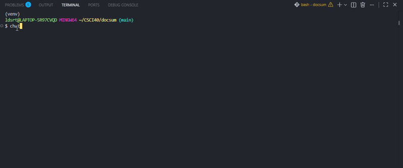

# chatLLM - Chat with your codebase


[](https://pypi.org/project/cmc-csci040-ryankim/)
[](https://codecov.io/gh/ryankim8/llmLabv1)

An AI-powered terminal chat agent that lets you explore and query local files using natural language, powered by Groq.

## Demo


## Install & Run

``` bash
pip install cmc-csci040-ryankim
chat
```
### Example querying a folder (eBay Scraper)

This example shows how the agent can read a project's README and file structure to answer questions about its detail

```
$ cd testProjects/ebayWebsraper
$ chat
chat> /ls
./README.md ./ebay-dl.py ./hammer.csv ./hammer.json ./xbox.csv ./xbox.json
chat> /cat README.md
# README.md content
chat> tell me about the project and also what other files are in the root directory
The project is an eBay listing scraper, which scrapes eBay search results and saves the listings to a file in either JSON or CSV format. The script takes a search term from the command line, loads eBay search result pages, extracts listing information, and stores the data in a structured format.

As for the other files in the root directory, they are:

- `README.md`: project documentation
- `__pycache__`: a directory containing cached Python bytecode
- `ebay-dl.py`: the main scraper script
- `hammer.csv`, `hammer.json`, `xbox.csv`, `xbox.json`, `light bulb.csv`, `light bulb.json`: example output files in CSV and JSON format for the search terms "hammer", "xbox", and "light bulb"
```

